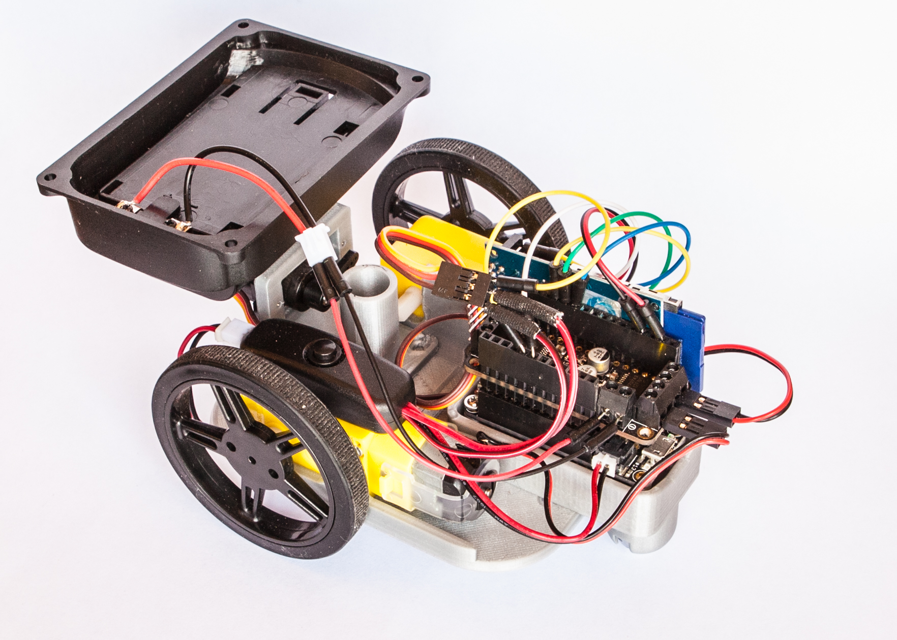
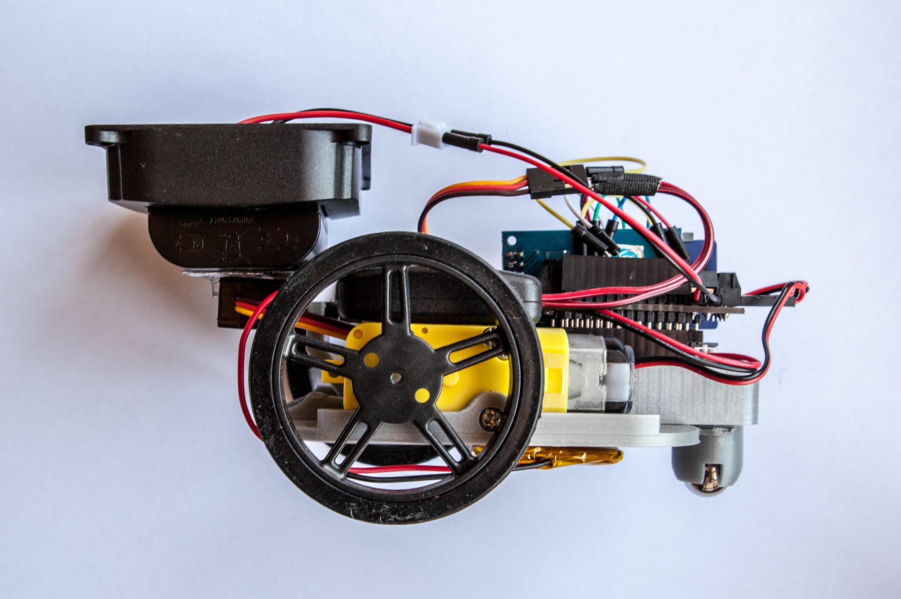
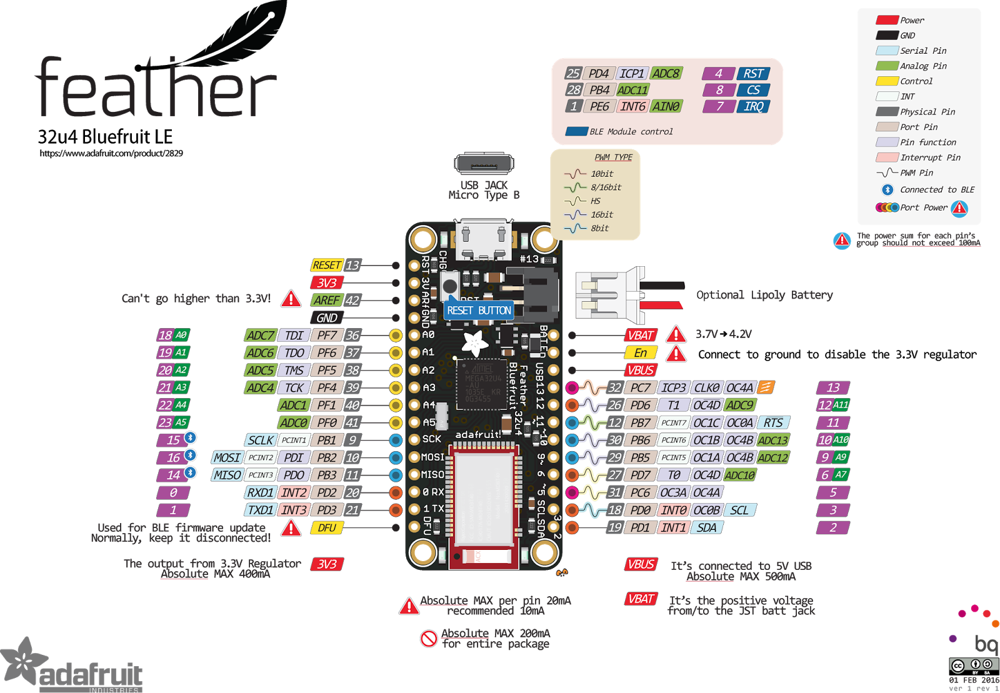

# Drawing Robot - DAKOTA BLACK

A wheeled robot that interprets G-code to draw images. 

## Summary

This project:
- creates a vector tracing of an image (in Illustrator)
- convert the vector drawing to gcode. (in Incscape w/ gcode plugin)
- store gcode on a sd card 
- set the starting point as the origin
- read gcode line by line
- execute x and y comands to postition the robot.
- execute z up and down comands to raise and lower a pen 

## Component Parts
- feather: https://www.adafruit.com/product/2829
- Cannon Battery adapter:https://www.amazon.com/gp/product/B079CD2G2N/ref=oh_aui_detailpage_o03_s00?ie=UTF8&psc=1
- Cannon battery: https://www.amazon.com/STK-Battery-Cameras-BG-E14-BG-E13/dp/B005DEHVC8/ref=pd_lutyp_simh_2_3?_encoding=UTF8&pd_rd_i=B005DEHVC8&pd_rd_r=YMSW6Q2MXV2WC7TTP3C1&pd_rd_w=knZ3a&pd_rd_wg=mWsqX&psc=1&refRID=YMSW6Q2MXV2WC7TTP3C1
- Addafruit addabox 002 kit:https://www.adafruit.com/product/3235
- geared dc motors for the wheels:https://www.adafruit.com/product/3777
- a servo to raise and lower the pen:https://www.adafruit.com/product/169
- a motorshield to run the dc motors:https://www.adafruit.com/product/2927
- an sd card and sdcard shield to store the Gcode:https://www.adafruit.com/product/254

## Challenges

keeping track of the wheels and moving the robot accurately and tracking the movement of the robot was the greatest challenge.

## Timeline

- Week 1: Write proposal, basic prototype
- Week 2: pen up & down, wheel tracking, postion tracking
- Week 3: gcode from sd card 
- Week 4: fine tune!
- Week 5: Present!

## final
 
 
 
 
 

## References and link
 
  http://reprap.org/wiki/Arduino_GCode_Interpreter
  
  http://www.instructables.com/id/Arduino-Drawing-Robot/
  
  https://learn.adafruit.com/adafruit-micro-sd-breakout-board-card-tutorial?view=all
  
 
